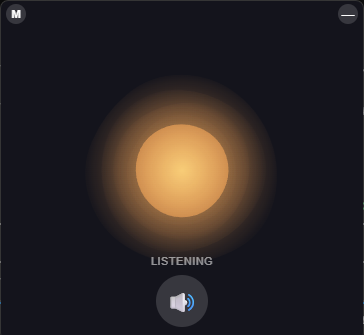

# Orbit

[](LICENSE)


A local, floating-window voice assistant client for [Turnstone](https://github.com/turnstonelabs/turnstone).
Push-to-talk is gone — Orbit listens continuously via voice-activity detection (VAD),
transcribes with Whisper, sends the request to a Turnstone workstream, and speaks the
reply back with Piper TTS. Talk over it mid-sentence and it stops, *if* what you said
actually transcribes to real words — background noise or its own voice bleeding back
into the mic won't false-trigger it.

<p align="center">
  
</p>

Runs on Windows and Linux, with GPU acceleration for NVIDIA (CUDA) and AMD/Intel
(Vulkan) GPUs.

## Features

- **Floating avatar window** — a small, frameless, draggable orb that changes
  color/motion with state (idle/listening/recording/thinking/speaking) and reacts to
  TTS loudness in real time.
- **VAD-driven listening, no push-to-talk** — Silero VAD detects when you start and
  stop talking. Sensitivity (low/medium/high) is adjustable from the UI and persists
  across restarts.
- **Barge-in** — talk over the assistant while it's speaking and it stops
  immediately, but only once your speech is confirmed as real words via a real
  transcription, not just any sound crossing a volume threshold.
- **Cross-platform STT with a GPU fallback chain** — tries CUDA (NVIDIA) via
  faster-whisper, then Vulkan (AMD/Intel/NVIDIA) via `pywhispercpp`/whisper.cpp if
  installed, then CPU. Verified on a Quadro P500 (CUDA) and an Intel Arc Pro B70
  (Vulkan).
- **`voice_test.py`** — a simpler push-to-talk CLI fallback, sharing the same
  STT/TTS/Turnstone modules, useful for quick sanity checks without the GUI.
- **System tray icon** — show/hide the floating window, toggle mute, or quit
  without hunting for a small frameless window behind other apps. Windows-only
  for now (see Known limitations).

## Privacy

Orbit's mic is **always on** while the app is running -- there's no push-to-talk
button, by design (see Features above). It's continuously listening for speech via
local voice-activity detection, not continuously recording, but it's worth being
explicit about what that means and where things actually go:

- **Audio never leaves your machine.** Speech-to-text (Whisper) and text-to-speech
  (Piper) both run entirely locally. Raw audio is never sent anywhere.
- **The transcribed text of what you say is sent to your Turnstone server** (whatever
  `TURNSTONE_CONSOLE_BASE` points at) to get a response -- that's the one network
  request this app makes with anything you've said. If that's your own
  self-hosted Turnstone instance, this stays on your own infrastructure.
- **If your Turnstone server is itself configured to use a third-party LLM API**
  (Anthropic, OpenAI, or similar) as its backend, the transcribed text of your
  speech gets forwarded there too, as part of Turnstone generating a response --
  that's a property of how you've configured Turnstone, not something this app
  does directly, but it's a real hop your words take that's easy to lose track of.
  Check your Turnstone server's own configuration if that distinction matters to you.

## Setup

### Windows

```
pip install -r requirements.txt
```

Optionally, once dependencies are installed, run `.\create_shortcut.ps1` to add a
"Orbit" entry to the Start Menu (findable via Windows Search) that launches with
`pythonw.exe` -- no console window behind the floating avatar. Safe to re-run any
time; it just overwrites the existing shortcut. Auto-detects a `.venv`/`venv311`/
`venv` folder in this directory, falling back to whatever `pythonw.exe` is on PATH.

### Linux

```
./install-linux.sh
```

Installs system packages (PortAudio + the ALSA-PulseAudio bridge, GTK/WebKit2GTK for
the GUI, build headers) and creates a `.venv-linux` with `requirements-linux.txt`.
See that file's comments for the optional Vulkan STT backend (needs a from-source
build, not covered by the install script).

### Both platforms

You'll also need:
- `piper_models/en_US-lessac-medium.onnx` (+ its `.json`) — gitignored, not fetched
  automatically. Grab it from the [Piper voices repo](https://github.com/rhasspy/piper/blob/master/VOICES.md).
- A Turnstone auth token, via either the `TURNSTONE_TOKEN` env var or a
  `.turnstone_token` file (gitignored) next to the scripts.
- Your Turnstone console address, via either the `TURNSTONE_CONSOLE_BASE` env var or
  a `.turnstone_console_base` file (gitignored) — see `turnstone_client.py`.

Then:
```
python assistant_app.py      # GUI, VAD-driven
python voice_test.py         # CLI, push-to-talk fallback
```

## Why Piper for TTS?

Orbit defaults to [Piper](https://github.com/rhasspy/piper) (VITS-based) rather than
a higher-quality option because it's dramatically faster — about 25x faster in
testing — than the alternative evaluated during development,
[Kokoro](https://github.com/hexgrad/kokoro) (StyleTTS2-based). Kokoro sounds
noticeably better, but on the hardware this was built on (an NVIDIA Quadro P500 —
Pascal generation, no tensor cores) its GPU path failed outright (`CUBLAS failure 8:
the function requires an architectural feature absent from the device`, i.e. an
actual hardware gap, not a bug), and CPU-only it ran at ~2.3x real-time — too slow to
feel conversational. Piper needs no GPU at all and measured 0.09x real-time on the
same machine.

**If you have a modern NVIDIA GPU with tensor cores** — RTX 20-series (Turing) or
newer (so any RTX 20/30/40/50-series card, or a datacenter card like a V100, A100, or
H100) — Kokoro-on-GPU is likely to actually be fast enough for real-time use there,
trading some of Piper's speed for meaningfully better voice quality. TTS isn't
currently behind a pluggable backend the way STT is (see below); swapping it in means
editing `tts.py`'s `load_piper()`/`speak()` functions directly, but the module is
self-contained, so it's a contained change.

## Project layout

| File | Purpose |
|---|---|
| `assistant_app.py` | pywebview GUI host, mic loop, VAD state machine, barge-in logic |
| `stt.py` | Whisper STT — CUDA / Vulkan / CPU backend selection |
| `tts.py` | Piper TTS, markdown stripping, streaming playback with amplitude callback |
| `turnstone_client.py` | Plain-HTTP Turnstone client (create/ask/close a workstream) |
| `vad.py` | Silero VAD wrapper (ONNX-only, no torch dependency) + utterance-boundary detector |
| `web/avatar.html` | The floating orb UI (canvas animation, drag/mute/minimize/sensitivity controls) |
| `voice_test.py` | Push-to-talk CLI fallback |
| `requirements.txt` / `requirements-linux.txt` | Pinned deps per platform |
| `install-linux.sh` | Linux system-package + venv setup |

## Known limitations

- No acoustic echo cancellation. The mic stays open during TTS playback for barge-in
  to work; on hardware without a headset (speaker bleed into the mic), this is
  mitigated by requiring a real transcription before treating anything as a genuine
  interruption, but isn't a substitute for real AEC.
- Real desktop transparency (`transparent=True`) doesn't work on Windows in
  pywebview 6.2.1 — the window uses a solid dark background color instead. The
  obvious workaround, WinForms' `TransparencyKey` color-keying, was prototyped and
  rejected: it only punches through pixels that exactly match the key color, so the
  avatar's soft alpha-gradient glow renders as a hard-edged flat color instead of
  blending into the desktop — confirmed live via screenshot, a clear regression
  from the current solid-background look, not an improvement. Untested on Linux
  (couldn't be visually verified in the dev environment this was built in).
- The Vulkan STT backend needs a from-source build and hasn't been tested on AMD
  hardware yet (verified on Intel; should work on AMD too, since Vulkan itself is
  vendor-neutral, but that's not yet confirmed on real AMD silicon).
- The system tray icon is verified on Windows only. On Linux it needs an actual
  system tray protocol available (AppIndicator3/ayatana, or a desktop environment
  still supporting the legacy freedesktop systray spec) that `install-linux.sh`
  doesn't provision — untested there. Fails gracefully either way: a missing/
  unsupported tray backend logs a warning and the assistant runs normally without
  the tray icon, rather than failing to start.
- No packaged installer yet (deliberately — see `requirements-linux.txt`'s comments
  for why a plain script is the right stage for this project right now). A frozen
  binary is a reasonable next step once the app's been run on a few more real
  machines.

## License

MIT — see [LICENSE](LICENSE).
